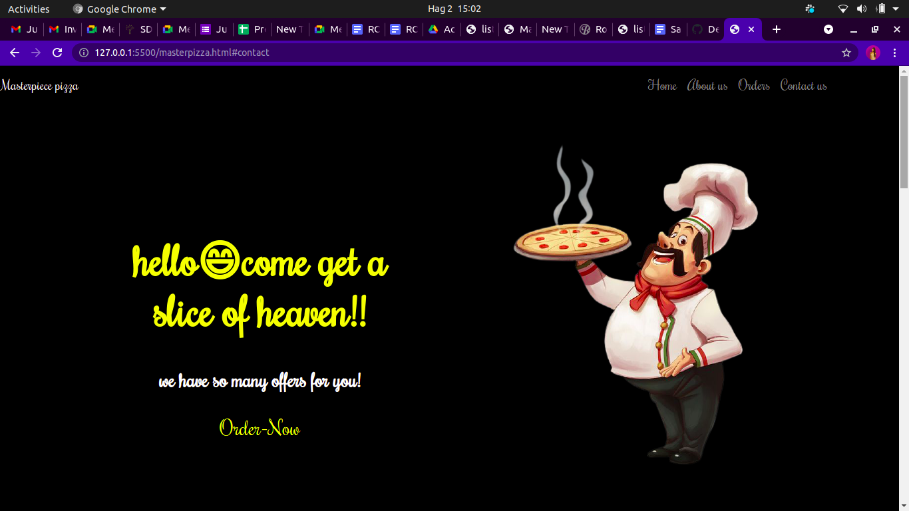
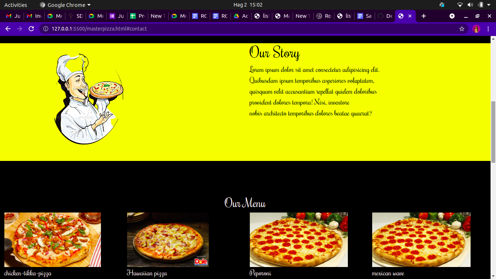
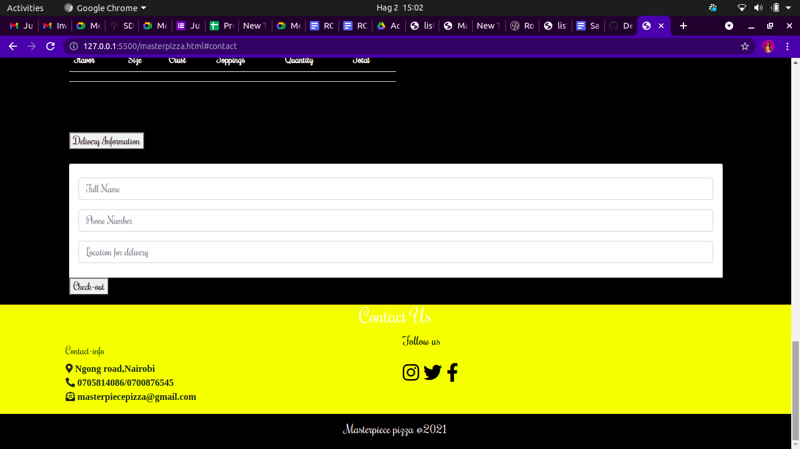

## Masterpiece Pizza.
## Built and Designed by Nancy Kigotho.
## 1/08/2021.
## Description.
* This is a website where you can order a pizza.Select what flavor you want,toppings,crust, and the size that you want.
* It also has an option of delivery to your location.
## Instructions.
* select the size,flavor,crust and the toppings you want.
* If you want it delivered fill in the your name,phone number and location.
## Setup

* Open Terminal {Ctrl+Alt+T}

* https://github.com/nancymukuiya14/masterpiece-pizza.git

* cd masterpiece-pizza

* code . or atom . depending on the text editor of your choice.

## Technologies Used.
* HTML.
* CSS.
* Bootstrap
* Javascript.
* Jquery.
## Contact Information.
* if you have any questions about the project please contact me via nancykigotho14@gmail.com.
or call 0705814086.
## Requirements.
* Github.
* Git.
* web browser.
## live link.

## Known Bugs
Thankfully i have no bugs in this project.

## Images.

## Licence.
Copyright 2021 <COPYRIGHT HOLDER>
